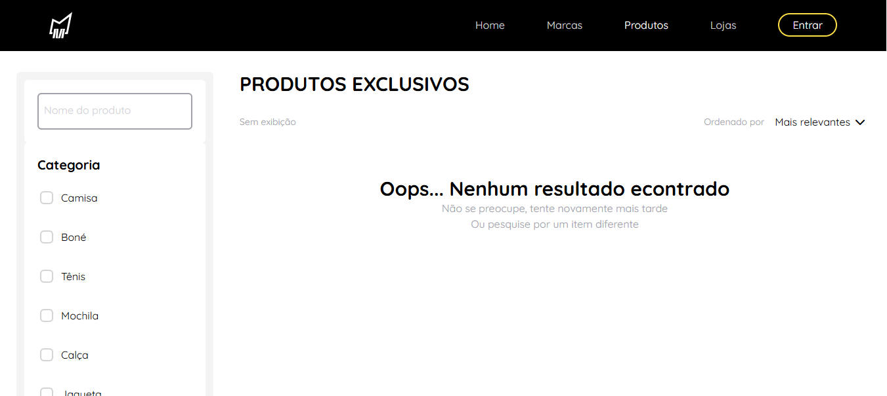

<div align="center">
<h1 align="center">Urban StreetWear</h1>
<a href="https://urban-strw-front.vercel.app/">Clique aqui para conferir</a> | <a href="https://github.com/kiq17/urban-strw-back">Backend da aplicação</a>
</div>

<br>

Projeto de um site e-commerce com foco na moda streetwear.

> [!IMPORTANT]  
> Caso as imagens não estajam carregando faço o reload da página

## Tecnologias

- Vue
- Vue Router
- TypeScript
- Pinia
- Yup
- Pinia
- VueUse
- Hero Icons

## Funcionalidades

- Cadastro de conta com verificação por e-mail
- Editar dados da conta
- Favoritar item
- Carrinho de compras
- Filtro de produtos

## Sumário

<details open>
<summary><b>(Clique para abrir ou fechar)</b></summary>
<!-- MarkdownTOC -->

- [Componentes](#driver-installation-instructions-on-linux)
  a. [Header](#a)
  b. [Modal](#modal)
  c. [Input](#a-input)
- [Arquitertura](#alfa-driver-dvds)
    - [Dominio](#disk-1-alfa_driver_dvd_old)
      1. [Casos de uso](#disk-1-alfa_driver_dvd_old)
      1. [Modelos](#disk-1-alfa_driver_dvd_old)
      1. [Erros](#disk-1-alfa_driver_dvd_old)
    - [Data](#disk-1-alfa_driver_dvd_old)
    - [Main](#disk-1-alfa_driver_dvd_old)
    - [Infra](#disk-1-alfa_driver_dvd_old)

        
</details>

### Header


#### Local

```
📂src
 ┣ 📂presentation
 ┃ ┣ 📂components
 ┃ ┃ ┗ 📜Header.vue
```

A. Logotipo do site

B. Barra de navegação

C. Links internos

- Ao clicar o scroll é ativado e leva para sessão correspondente

  ```js
  function handleNavigate(value: string) {
    // seleciona a section
    const element = document.querySelector(`[data-section=${value}]`);
    if (!element) return;

    // ativa o scroll para sessão desejada de forma suave (smooth), calculando o tamanho do header
    window.scrollTo({
      top: (element as HTMLElement).offsetTop - 100,
      behavior: "smooth",
    });
  }
  ```

- Após isso o texto do link fica com uma tonalidade mais clara

D. Butão do menu

- Ao clicar abre-se um modal para o login do usuário

### Responsividade

Quando o Breakpoint de 500px é atividado


Quando o Breakpoint de 360px é ativado


C. Ao mudar a resolução da tela o menu se transforma dando lugar a um butão mobile

- Ao clicar abre um dropdown com os links e o butão de login

```js
// controla a abertura e fechamento do dropdown
const isOpen = ref<boolean>(false);

@click="() => (isOpen = !isOpen)"
```

- A sessa marcas é retirada do menu, pois na versao mobile do site essa sessa não existe

```js
// função ativa quando app é renderizado pelo primeira vez
onMounted(() => {
  window.addEventListener("resize", handleSizeChange);
  handleSizeChange();
});

// função ativa quando app é "desmontado"
onUnmounted(() => {
  window.removeEventListener("resize", handleSizeChange);
});

// realiza a mudanca dos itens do Ref no Vue
function handleSizeChange() {
  if (window.innerWidth < 1000) {
    itens.value = ["home", "produtos", "eventos"];
  } else {
    itens.value = ["home", "marcas", "produtos", "lojas"];
  }
}
```

### Imagens da home page

#### Local

```
📂src
 ┣ 📂presentation
 ┃ ┣ 📂components
 ┃ ┃ ┗ 📜BannerHome.vue
```

As imagens possuem um modo de carregamento diferente. Em vez de ser carregada de forma fracionada, aparecendo de parte em parte, foi adicionada uma imagem com um tamnho menor e resolução menor porém ao implementar alguns estilos el fica com efeito embaçado, melhorando visualmente o carregamento para o usuário.


```js
watch(imgHtml, () => {
  if (imgHtml.value) {
    if (imgHtml.value.complete) {
      loading.value = false;
    } else {
      imgHtml.value.addEventListener("load", () => (loading.value = false));
    }
  }
});
```

Uma classe dinamica é adionada para fazer o efeito de blur depende do loading. Uma imagem comprimida é exposta durante o carregamento, enquanto a imagem principal é carregada.

```html
<div :class="loading ? 'load' : ''"></div>
```

### Sessão produtos

#### Local

```
📂src
 ┣ 📂presentation
 ┃ ┣ 📂components
 ┃ ┃ ┗ 📜ItensSection.vue
```


A. Título do produto possui um split para adicionar "..." caso o texto for muito grande

B. Butão para adicionar item ao carrinho, caso o usuário não possuir uma conta um modal de login irá abrir

### Modal

#### Local

```
📂src
 ┣ 📂presentation
 ┃ ┣ 📂components
 ┃ ┃ ┗ 📜Modal.vue
```


Ao clicar no butão "Entrar" abre-se um modal com animação fade

Possui um fundo preto com opacidade e uma janela. A estrutura HTML é transportada para o body, porém o código está dentro da div que é renderizada pelo Vue.

Para realizar fazer essa abordagem, foi utilizado o `<Teleport>`, um componente integrado que permite "teletransportar" uma parte do modelo de um componente para DOM que existe fora da hierarquia DOM desse componente.

Sintaxe:

```html
<Teleport to="body">
  <!-- Código -->
</Teleport>
```

#### A. Input 

```
📂src
 ┣ 📂presentation
 ┃ ┣ 📂components
 ┃ ┃ ┣ 📂shared
 ┃ ┃ ┃ ┗ 📜Input.vue
```

Por se utilizado em várias partes do site o foi criado um componente para o input que possui essas props:

```js
  interface inputProps extends InputHTMLAttributes {
      label: string
      value: string
      handleChange: (value: string) => void
      mask?: "cpf" | "cnpj" | "cep" | "cartao" | "name"
  }
```

A máscara seria para formatar o valor que é digitado pelo usuario. Exmplo cpf digitado é trnasformado em 999.999.999-99 em vez de ser um 99999999999

A handleChange é usada para passar o valor para a uma ref e também fazer validação do que é digitado

B. Icone para mudar tipo do input

- Ao clicar no icone transforma o input do `"type"="password"` para o `"type"="text"`, possibilitando a visualização do texto

C. Butão

- Ao clicar verifica os dados e executa função que irá enviar os dados para API, enquanto isso o texto do butão é substituido por um loading

D. Butão criar conta

- Leva o usuário para a pagina de cadastro

E. Login com o Google Account

- Por nao ter sido implementado ainda está desabilidatado com o hover

### Página produtos

#### Local

```
📂src
 ┣ 📂presentation
 ┃ ┣ 📂pages
 ┃ ┃ ┗ 📜Products.vue
```

Nesta página tem a renderização dos produtos, primeiro é realizado o loading do produto enquanto isso é mostrada uma animação pulse.


Para fazer esse efeito foi utilizado uma Ref do Vue para controlar o loading durante a chamada para API

```html
<div v-if="loading" class="w-1/2 h-9 rounded-md animate-pulse bg-zinc-300"></div>
```

Caso ocorra algum erro durante a chamada para API um mensagem é mostrado na tela em vez dos produtos. Essa mensagem também é mostrado caso nenhum produtos for encontrado durante a utilização do filtro



### Página produto

#### Local

```
📂src
 ┣ 📂presentation
 ┃ ┣ 📂pages
 ┃ ┃ ┗ 📜ProductSingle.vue
```


A. Butão comprar

- Leva o usuário para página de comprar, porém caso ele não esteja logado irá abrir o modal de login

B. Butão para adicionar no carrinho

- Adiciona no carrinho do usuário o item escolhido, porém caso ele não esteja logado irá abrir o modal de login.

B. Butão para favoritar item

- Adiciona no perfil do usuário o item escolhido, porém caso ele não esteja logado irá abrir o modal de login.

## Arquitetura

A aplicação foi desenvolvida utilizando o conceita da arquitura limpa

## Domain

O domain foi divido em: Casos de uso, modelos e erros

A. Casos de uso

1. Autenticação

```js
  export interface Authentication{
      auth: (params: Authentication.Params) => Promise<Authentication.Model>
  }

  export namespace Authentication{
      export type Params = {
          email: string;
          senha: string
      }

      export type Model = AccountModel
  }
```

2. Carregar produtos favoritados pro um usuário

```js
  export interface LoadFavoritesUserProducts {
    collect: () => Promise<LoadFavoritesUserProducts.Model[]>;
  }

  export namespace LoadFavoritesUserProducts {
    export type Model = {
      product: ProductModel;
      created_at: Date;
    };
  }
```

4. Carregar produtos utilizando filtro

``` js
  export interface LoadProductsWithFilter {
    collect: (
      params: LoadProductsWithFilter.Params
    ) => Promise<LoadProductsWithFilter.Model>;
  }

  export type Order = "recente" | "relevante" | "maior" | "menor";

  export namespace LoadProductsWithFilter {
    export type Params = {
      category?: string;
      name?: string;
      price?: string;
      order?: Order;
      page?: number;
      per_page?: number;
    };

    export type Model = LoadProductsWithFilterModel;
  }
```

5. Compra de um item

```js
  export interface Order {
    buy: (data: Order.Params) => Promise<boolean>;
  }

  export namespace Order {
    export type Params = {
      productId: number;
    };
  }
```

6. Cadastro de usuário

```js
  export interface SignUp {
    create: (params: SignUp.Params) => Promise<SignUp.Model>;
  }

  export namespace SignUp {
    export type Params = {
      nome: string;
      email: string;
      senha: string;
      preferences: string[];
    };

    export type Model = SignUpModel;
  }
```

B. Modelos

Basicamente interfaces que tipam o retorno esperado de cada caso de uso e objetos

1. Conta

```js
  export interface AccountModel {
    user: string;
    hash: string;
  }
```

2. Cartão de crédito

```js 
  export interface CreditCardModel {
    number: string;
    cvv: string;
    month: string;
    year: string;
    name: string;
  }

```

3. Entrega 

```js
  export interface DeliveryData {
    street: string;
    city: string;
    state: string;
    neighborhood: string;
    houseNumber: number;
    houseType: string;
    cep: string;
  }
```

4. Carregar produtos com filtro

```js
  export interface LoadProductsWithFilterModel {
    products: ProductModel[];
    finded: number;
    count: number;
  }
```

5. Produto

```js
  export interface ProductModel {
    nome: string;
    descricao: string;
    preco: number;
    quantidade: number;
    coverImg: string;
    categoria: string;
    id: number;
    a_venda: boolean;
    created_at: Date;
    update_at: Date;
    slug: string | null;
    favorites: number;
  }
```

6. Dados pessoais

```js
  export interface SelfData{
      fullName: string;
      email: string;
      cpf: string;
  }
```

7. Cadastro

```js
  export interface SignUpModel {
    id: number;
    nome: string;
    email: string;
    created_at: Date;
  }
```

C. Errors

Classes criadas para lançar errors personalizados

1. Email já utilizado

```js
  export class EmailAlreadyUsedError extends Error {
      constructor() {
        super("O e-mail fornecido já foi cadastrado");
        this.name = "EmailAlreadyUsedError";
      }
  }
```
2. Dados incorretos

```js
  export class InvalidCredentialsError extends Error {
    constructor() {
      super("Email ou senha incorretos");
      this.name = "InvalidCredentialsError";
    }
  }
```
3. Não encontrado

```js
  export class NotFoundError extends Error {
    constructor() {
      super("Informação não encontrada");
      this.name = "NotFoundError";
    }
  }
```
4. Não autorizado

```js
  export class UnauthorizedError extends Error {
    constructor() {
      super("Acesso negado");
      this.name = "UnauthorizedError";
    }
  }
```

4. Inesperado

```js
  export class UnexpectedError extends Error {
    constructor() {
      super("Algo de errado aconteceu. Tente novamente em breve.");
      this.name = "UnexpectedError";
    }
  }
```

## Data

Nesta camada ocorre a implementação dos casos de usos


```js
  export class RemoteAuthentication implements Authentication {
    constructor(
      private readonly url: string,
      private readonly httpClient: HttpClient<AccountModel>
    ) {}
  }
```
em Todos os casos de usos são feitas chamdas para API, por isso todos os construtores tem como parametro url e httpClient.

o httpClient é uma forma de cirar um meio de pode realizar um troca mais rapido para um biblioteca http sem precisa mexer muito no código da aplicação. Fazendo que a aplicaçõ não fique presa a um fator externo.

```js
  export type HttpRequest = {
    url: string;
    method: HttpMethod;
    body?: any;
    headers?: any;
    params?: any
  };

  export interface HttpClient<R = any> {
    request: (data: HttpRequest) => Promise<HttpResponse<R>>;
  }

  export type HttpMethod = "post" | "get" | "put" | "delete";

  export enum HttpStatusCode {
    ok = 200,
    created = 201,
    noContent = 204,
    badRequest = 400,
    unauthorized = 401,
    forbidden = 403,
    notFound = 404,
    serverError = 500,
  }

  export type HttpResponse<T = any> = {
    statusCode: HttpStatusCode;
    body?: T;
  };

```

## Infra 

Resnsavel por manter dependencias externas da aplicação e adaptar elas conforme o uso. Utilizando o exemplo do HttpClient da camada Data, temos o adapter do axios:

```js
  export class AxiosAdapter implements HttpClient {
    async request({
      method,
      url,
      body,
      headers,
      params
    }: HttpRequest): Promise<HttpResponse> {
      try {
        const { data, status } = await axios.request({
          method,
          url,
          data: body,
          headers,
          params,
          withCredentials: true
        });
        return {
          statusCode: status,
          body: data,
        };
      } catch (error: unknown) {
        const axiosError = error as AxiosError;

        if (axiosError.response) {
          return {
            statusCode: axiosError.response.status,
            body: axiosError.response.data,
          };
        }

        return {
          statusCode: 500,
          body: "Internal Server Error",
        };
      }
    }
  }
```

Esse código faz com que o axios de adpte ao código do HttpClient que está respeita a lógica da aplicação.

## Main

Finalização do que está sendo implementado na camada Data e um pouco do código que está ligado ao Vue

```js
  export const makeRemoteAuthentication = (): Authentication =>
  new RemoteAuthentication(makeApiUrl("/users/login"), makeAxiosHttpClient());
```
Nesse caso se ve uma grande vantagem de utilizar a arquitetura limpa, caso seja necessário utilizar outra blibioteca em vez do Axios, seria necessário mudar apenas uma linha. Logicamente também criar um adater para a biblioteca

```js
  export const makeRemoteAuthentication = (): Authentication =>
  new RemoteAuthentication(makeApiUrl("/users/login"), makeOutraBlibioteca());
```

## Presentation

Apresentção da aplicação

```html 
  <Teleport to="body">
      <Transition>
        <Modal
          v-if="modalControl.show.value"
          :authentication="makeRemoteAuthentication()"
          :validation-field="makeYupValidationFields()"
          :validation-form="makeYupValidationForms()"
          :storage="storage"
          @close="modalControl.closeModal"
        />
      </Transition>
    </Teleport>
```

O código não deve ser implementado dentro do componente, código do modal deve ser referente ao modal (interações com o dom), diferente disso deve seguir a linha:

Domain => Data => Main

Depois ser passado como prop para o componente